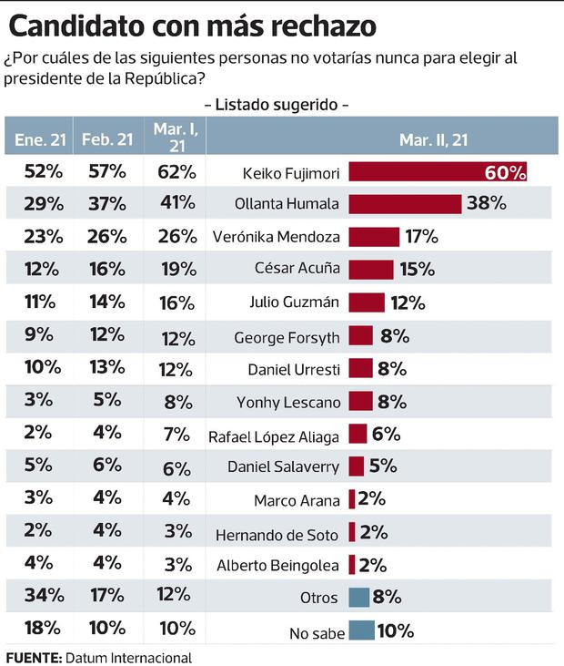
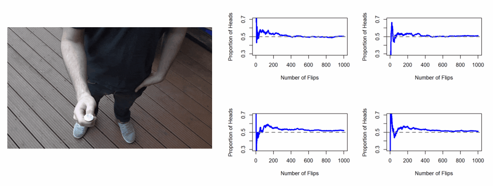
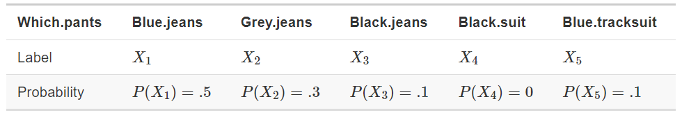
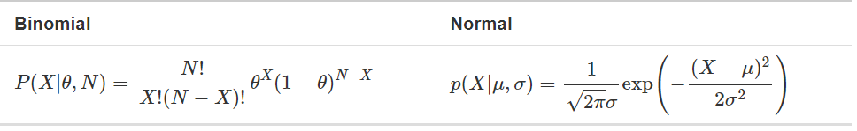
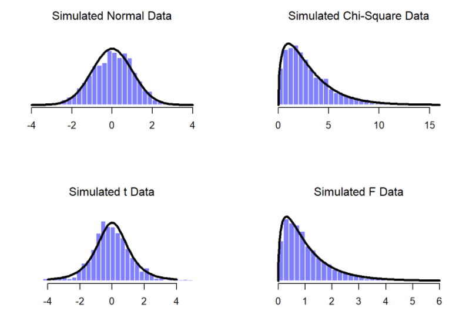

```{r child = "../setup.Rmd"}
```

```{r packages, echo=FALSE, message=FALSE, warning=FALSE}
# AGREGAR PAQUETES A UTILIZAR

```
class: inverse, center, middle

## CLASE 1 
### ESTADÍSTICA INFERENCIAL EN R

---

## Introducción

- R es un entorno y lenguaje de programación ampliamente usado en la ciencia de datos, principalmente en el análisis estadístico.


---

## Estadística inferencial

- La estadística inferencial se centra en el estudio de técnicas y procedimientos que nos permiten mediante los datos tomados a una muestra, determinar las características de una población.
- La incapacidad de hacer **predicciones** es la consecuencia lógica de "no hacer suposiciones".
- La teoría de la inferencia estadística se basa en la **teoría de la probabilidad**.

---





---

## La probabilidad

- La probabilidad es una rama de las matemáticas que nos permite averiguar con qué frecuencia sucederán diferentes tipos de sucesos o eventos aleatorios.
- Se puede definiar la probabilidad con un número del 0 al 1. Ejm: Pdado(6) = 1/6 ; Pmoneda(cara) = 0.5 , etc
- En la teoría de la probabilidad, el modelo es conocido, pero los datos no.

---

## Visión frecuentista

- Este punto de vista define la probabilidad como una frecuencia a largo plazo.




---

## Visión bayesiana

- Este punto de vista, también llamado probabilidad subjetiva, define la probabilidad de un evento como el grado de creencia que un **agente inteligente** asigna a la ocurrencia de un evento.
- El punto de vista frecuentista no permite que dos observadores atribuyan diferentes probabilidades al mismo evento: cuando eso sucede, al menos uno de ellos debe estar equivocado. La visión bayesiana no evita que esto ocurra.

---

## Reglas de la probabilidad

- El evento elemental: Es el resultado de una observación sobre algún evento.
- Espacio muestral: Es el conjunto de todos los eventos posibles.
- Para un evento "X" su probabilidad estará entre 0 y 1.








---

## Distribuciones 





---

## Distribuciones binomiales

- En R, existe la función **dbinom()** que nos permite obtener las probabilidades binomiales para un suceso o evento en específico.

```{r , echo = TRUE , collapse = TRUE}

# PROBABILIDADES BINOMIALES

# x = número de veces que saldra el 6
# size = veces en las que lanzamos el dado
# prob = probabilidad de sacar un 6 en el dado

dbinom(x = 2, size = 20, prob = 1/6)

    
```

---

## Distribuciones normales

- En R, existe la función **dnorm()** que nos permite obtener las probabilidades normales para un suceso o evento en específico.

```{r , echo = TRUE , collapse = TRUE}

# PROBABILIDADES NORMALES

# x = número de veces que saldra cara
# mean = promedio de las probabilidades
# sd = desviacion estandar de las probailidades 

dnorm(x = 1, mean = 1, sd = 0.1 )

```   

---

class: inverse, center, middle

# GRACIAS! <br/>  <a href="mailto: marvinjqs@gmail.com">  </a> 


